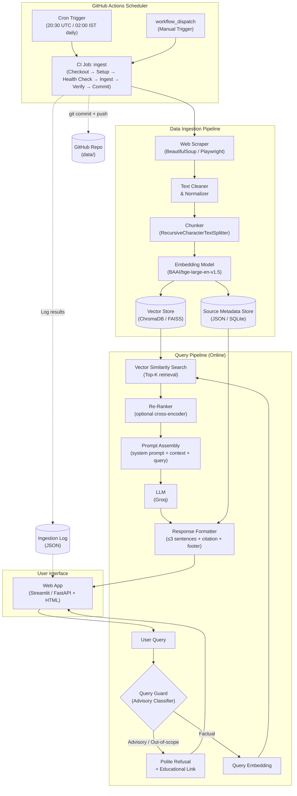
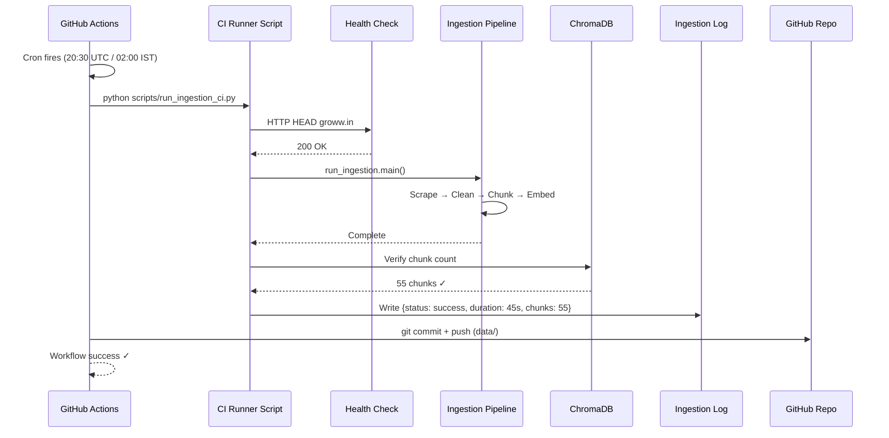
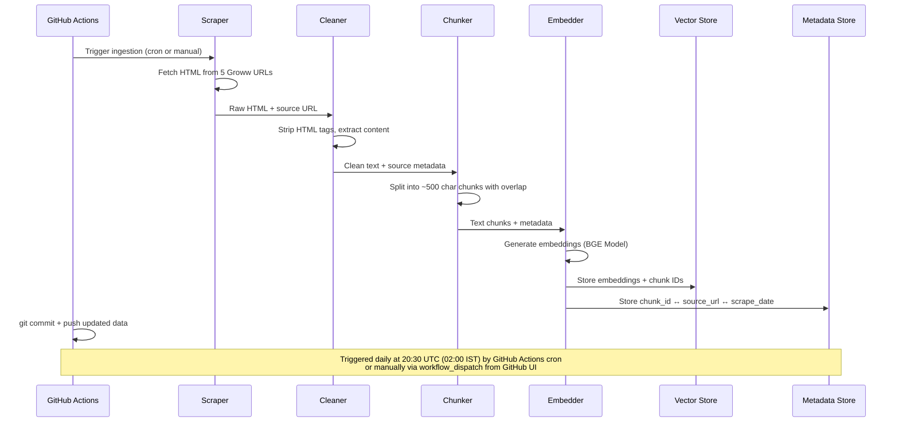
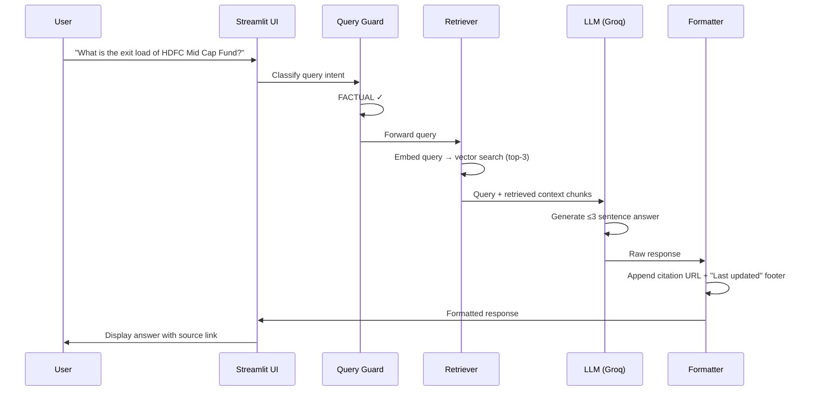
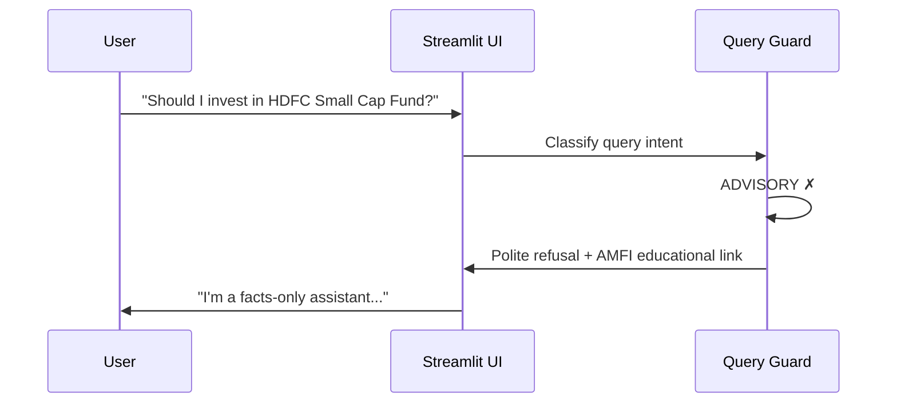

# Architecture: Mutual Fund FAQ Assistant (RAG Chatbot)

## 1. System Overview

The Mutual Fund FAQ Assistant is a Retrieval-Augmented Generation (RAG) chatbot that answers facts-only questions about HDFC Mutual Fund schemes. The system ingests content from designated Groww URLs, chunks and embeds the text into a vector store, and at query time retrieves the most relevant passages to ground an LLM response.

```
┌─────────────────────────────────────────────────────────────────────┐
│                        USER INTERFACE                               │
│          (Web UI — welcome message, example questions,              │
│                   disclaimer, chat input)                           │
└──────────────────────────┬──────────────────────────────────────────┘
                           │  user query
                           ▼
┌─────────────────────────────────────────────────────────────────────┐
│                      QUERY PIPELINE                                 │
│  ┌──────────────┐   ┌──────────────┐   ┌────────────────────────┐  │
│  │ Query Guard   │──▶│ Retriever    │──▶│ Response Generator     │  │
│  │ (Refusal      │   │ (Embedding + │   │ (LLM + Prompt Template │  │
│  │  Classifier)  │   │  Vector      │   │  + Citation Formatter) │  │
│  └──────────────┘   │  Search)     │   └────────────────────────┘  │
│                      └──────────────┘                               │
└──────────────────────────┬──────────────────────────────────────────┘
                           │
            ┌──────────────┴──────────────┐
            ▼                             ▼
┌────────────────────┐        ┌────────────────────────┐
│   VECTOR STORE     │        │   SOURCE METADATA DB   │
│ (ChromaDB / FAISS) │        │  (URL ↔ chunk mapping) │
└────────────────────┘        └────────────────────────┘
            ▲
            │ offline ingestion
┌────────────────────────────────────────────────────────────────────┐
│                     DATA INGESTION PIPELINE                        │
│  ┌────────────┐   ┌──────────────┐   ┌───────────────────────┐    │
│  │ Web Scraper │──▶│ Text Cleaner │──▶│ Chunker + Embedder    │    │
│  │ (Groww URLs)│   │ & Normalizer │   │ (BAAI/bge-large-en-v1.5)│    │
│  └────────────┘   └──────────────┘   │                       │    │
│                                       └───────────────────────┘    │
└────────────────────────────────────────────────────────────────────┘
```

---

## 2. High-Level Architecture Diagram



---

## 3. Component Details

### 3.1 Data Ingestion Pipeline

| Component | Responsibility | Details |
|---|---|---|
| **Web Scraper** | Fetch raw HTML from the 5 Groww scheme pages | Uses `BeautifulSoup` for static pages or `Playwright` for JS-rendered content. Respects `robots.txt`. Stores raw HTML with timestamps. |
| **Text Cleaner** | Strip HTML, remove ads/navigation, normalize whitespace | Extracts only the main content body (scheme details, fund info tables, FAQ sections). Preserves tabular data structure. |
| **Chunker** | Split cleaned text into retrieval-friendly chunks | Uses `RecursiveCharacterTextSplitter` with `chunk_size=500`, `chunk_overlap=100`. Each chunk carries metadata: `source_url`, `scheme_name`, `section_title`, `scrape_date`. |
| **Embedding Model** | Convert text chunks to dense vector representations | `BAAI/bge-large-en-v1.5` or `bge-small-en-v1.5`. Embedding dimension: 1024 (large) or 384 (small). |
| **Vector Store** | Persist and index embeddings for similarity search | **ChromaDB** (default, lightweight, file-based) or **FAISS** (for larger scale). Supports metadata filtering by scheme name. |
| **Source Metadata Store** | Map each chunk back to its source URL and scrape date | JSON or SQLite table with fields: `chunk_id`, `source_url`, `scheme_name`, `scrape_date`, `section_title`. Used for citation generation. |

#### Source URLs (Corpus)

| # | Scheme Name | Groww URL | Category |
|---|---|---|---|
| 1 | HDFC Gold ETF Fund of Fund | https://groww.in/mutual-funds/hdfc-gold-etf-fund-of-fund-direct-plan-growth | Commodity / Gold |
| 2 | HDFC Large Cap Fund | https://groww.in/mutual-funds/hdfc-large-cap-fund-direct-growth | Equity – Large Cap |
| 3 | HDFC Small Cap Fund | https://groww.in/mutual-funds/hdfc-small-cap-fund-direct-growth | Equity – Small Cap |
| 4 | HDFC Silver ETF Fund of Fund | https://groww.in/mutual-funds/hdfc-silver-etf-fof-direct-growth | Commodity / Silver |
| 5 | HDFC Mid Cap Fund | https://groww.in/mutual-funds/hdfc-mid-cap-fund-direct-growth | Equity – Mid Cap |

---

### 3.2 Query Pipeline

#### 3.2.1 Query Guard (Refusal Classifier)

**Purpose**: Detect and refuse advisory, opinion-based, or out-of-scope queries before they reach the retriever.

**Approach** (choose one):
- **Keyword + Pattern Matching**: Maintain a list of advisory trigger phrases (`"should I invest"`, `"which is better"`, `"recommend"`, `"predict"`, etc.)
- **LLM-based Classifier**: Use the LLM itself with a classification prompt to label the query as `FACTUAL` or `ADVISORY`
- **Hybrid**: Keyword pre-filter → LLM confirmation for borderline cases

**Refusal Response Template**:
```
I'm a facts-only assistant and cannot provide investment advice or 
recommendations. For investment guidance, please consult a certified 
financial advisor or visit [AMFI](https://www.amfiindia.com/) for 
educational resources.
```

#### 3.2.2 Retriever

| Parameter | Value | Rationale |
|---|---|---|
| Embedding Model | `BAAI/bge-large-en-v1.5` | High retrieval performance for English, robust for factual queries |
| Top-K | 3–5 | Retrieve the most relevant chunks |
| Similarity Metric | Cosine similarity | Standard for normalized embeddings |
| Metadata Filter | Optional `scheme_name` filter | If the query mentions a specific scheme, filter by that scheme first |

#### 3.2.3 Re-Ranker (Optional)

- Use a cross-encoder model (e.g., `BAAI/bge-reranker-large`) to re-rank the top-K results
- Improves precision for ambiguous queries
- Can be skipped in the initial version for simplicity

#### 3.2.4 Response Generator (LLM)

**Model**: **Groq** (e.g., Llama 3 or Mixtral via Groq API)
- **Pros**: Extremely low latency, high throughput, cost-effective API.
- **Cons**: Requires internet and API key.

**System Prompt**:
```
You are a facts-only mutual fund FAQ assistant. You ONLY answer factual, 
verifiable questions about HDFC Mutual Fund schemes using the provided 
context. 

STRICT RULES:
1. Answer in 3 sentences or fewer.
2. Use ONLY information from the provided context.
3. Include exactly ONE source citation link in your response.
4. End every response with: "Last updated from sources: <date>"
5. NEVER provide investment advice, recommendations, or opinions.
6. If the answer is not in the context, say: "I don't have this 
   information in my current sources."
7. NEVER fabricate or hallucinate information.
```

#### 3.2.5 Response Formatter

Ensures every response follows the required format:

```
<factual answer in ≤3 sentences>

Source: <URL>
Last updated from sources: <YYYY-MM-DD>
```

---

### 3.3 User Interface

**Framework**: Streamlit (for rapid prototyping) or FastAPI backend + simple HTML/JS frontend.

#### UI Components

| Component | Description |
|---|---|
| **Header** | App title: "HDFC Mutual Fund FAQ Assistant" |
| **Disclaimer Banner** | Persistent banner: "Facts-only. No investment advice." |
| **Welcome Message** | Greeting with brief description of capabilities |
| **Example Questions** | 3 clickable example queries (e.g., "What is the expense ratio of HDFC Large Cap Fund?") |
| **Chat Input** | Text input for user queries |
| **Chat History** | Scrollable conversation thread with user/assistant messages |
| **Source Citation** | Clickable link rendered below each assistant response |

#### Example Questions

1. "What is the expense ratio of HDFC Small Cap Fund?"
2. "What is the exit load for HDFC Mid Cap Fund?"
3. "What is the minimum SIP amount for HDFC Large Cap Fund?"

---

### 3.4 Scheduler Component (GitHub Actions)

**Purpose**: Automate daily re-ingestion of mutual fund data from Groww, ensuring the vector store always contains current NAV, returns, holdings, and fund information.

**Platform**: **GitHub Actions** — CI/CD-native scheduling with no additional runtime dependencies, built-in secrets management, version-controlled workflow configuration, and automatic failure notifications.

> **Why GitHub Actions over APScheduler?**
> - **No long-running process** — no need to keep a Python scheduler alive; GitHub runs the job serverlessly
> - **Built-in cron** — native `schedule` trigger with standard cron expressions
> - **Secrets management** — `GROQ_API_KEY` stored securely in GitHub repository secrets (not in `.env`)
> - **Logging & alerting** — workflow run history visible in GitHub UI, email notifications on failure
> - **Version-controlled** — the schedule lives in `.github/workflows/daily_ingestion.yml` alongside the code
> - **Free tier** — 2,000 min/month (public) or 500 min/month (private); a daily 2-minute job uses ~60 min/month

| Component | Responsibility | Details |
|---|---|---|
| **Workflow File** | Define the scheduled CI job | `.github/workflows/daily_ingestion.yml` — triggered by `schedule` (cron: `30 20 * * *` = 02:00 AM IST / 20:30 UTC) and `workflow_dispatch` (manual). |
| **CI Ingestion Runner** | Execute the ingestion pipeline in CI with safety checks | `scripts/run_ingestion_ci.py` — (1) Health check (HTTP HEAD to `groww.in`), (2) `run_ingestion.main()`, (3) Post-run ChromaDB verification, (4) Writes structured log to `data/ingestion_log.json`, (5) Non-zero exit on failure. |
| **Ingestion Log** | Track run outcomes for UI display | `data/ingestion_log.json` with fields: `timestamp`, `status` (success/failure), `duration_seconds`, `chunks_count`, `error_message`. Committed back to repo after each run. |
| **Data Commit Step** | Persist updated data to the repository | `git add` + `git commit` + `git push` of `data/raw/`, `data/processed/`, `data/vectorstore/`, and `data/ingestion_log.json` using `github-actions[bot]` identity. Skips commit if no files changed (idempotent). |

#### Scheduler Flow



#### Trigger Modes

| Mode | Trigger | When to Use |
|---|---|---|
| **Scheduled** (default) | Cron: `30 20 * * *` (02:00 AM IST daily) | Automated daily refresh — no manual intervention needed |
| **Manual** | `workflow_dispatch` from GitHub Actions UI (Actions tab → "Run workflow") | On-demand refresh when data staleness is detected or after scraper code changes |
| **Push-triggered** (optional) | `on: push` to `src/ingestion/` paths | Auto-re-ingest when ingestion code changes are merged |

---

## 4. Tech Stack

| Layer | Technology | Purpose |
|---|---|---|
| **Language** | Python 3.10+ | Primary development language |
| **Web Scraping** | `BeautifulSoup4`, `requests`, `Playwright` (fallback) | Fetch and parse Groww pages |
| **Text Processing** | `LangChain` (TextSplitter) | Chunking and document handling |
| **Embeddings** | `BAAI/bge-large-en-v1.5` | Vector embedding generation |
| **Vector Store** | `ChromaDB` | Persistent vector storage and retrieval |
| **LLM Framework** | `LangChain` | Prompt templating, chain orchestration |
| **LLM** | Groq API | Response generation |
| **UI** | `Streamlit` | Chat interface |
| **Scheduler** | `GitHub Actions` | Cron-based automated daily re-ingestion via CI/CD workflow |
| **Metadata** | JSON files / SQLite | Source URL and scrape date tracking |
| **Testing** | `pytest` | Unit and integration tests |

---

## 5. Project Directory Structure

```
RAG Chatbot/
├── Docs/
│   ├── problemStatement.md
│   ├── problemstatement.txt
│   └── Architecture.md
├── src/
│   ├── ingestion/
│   │   ├── __init__.py
│   │   ├── scraper.py            # Web scraping logic
│   │   ├── cleaner.py            # HTML cleaning and text normalization
│   │   └── chunker.py            # Text chunking with metadata
│   ├── embeddings/
│   │   ├── __init__.py
│   │   └── embedder.py           # Embedding generation and storage
│   ├── retrieval/
│   │   ├── __init__.py
│   │   ├── vector_store.py       # ChromaDB wrapper
│   │   └── retriever.py          # Similarity search + metadata filtering
│   ├── generation/
│   │   ├── __init__.py
│   │   ├── query_guard.py        # Refusal classifier
│   │   ├── prompt_templates.py   # System and user prompt templates
│   │   └── generator.py          # LLM response generation
│   ├── utils/
│   │   ├── __init__.py
│   │   ├── config.py             # Configuration and environment variables
│   │   └── formatter.py          # Response formatting (citations, footer)
│   └── app.py                    # Streamlit app entry point
├── .github/
│   └── workflows/
│       └── daily_ingestion.yml   # GitHub Actions cron workflow for daily re-ingestion
├── scripts/
│   └── run_ingestion_ci.py       # CI runner: health check + ingestion + verify + log
├── data/
│   ├── raw/                      # Raw scraped HTML
│   ├── processed/                # Cleaned text chunks with metadata
│   ├── vectorstore/              # ChromaDB persistence directory
│   └── ingestion_log.json        # Ingestion run history (updated by CI)
├── tests/
│   ├── test_scraper.py
│   ├── test_chunker.py
│   ├── test_retriever.py
│   ├── test_query_guard.py
│   ├── test_generator.py
│   └── test_ci_ingestion.py
├── .env                          # API keys (not committed; CI uses GitHub Secrets)
├── .gitignore
├── requirements.txt
└── README.md
```

---

## 6. Data Flow

### 6.1 Ingestion Flow (Automated Daily via GitHub Actions)



### 6.2 Query Flow (Online / Per Request)



### 6.3 Refusal Flow



---

## 7. Prompt Engineering

### 7.1 System Prompt

```
You are a facts-only mutual fund FAQ assistant for HDFC Mutual Fund schemes. 
Your knowledge comes exclusively from official Groww pages for the following 
schemes:
- HDFC Gold ETF Fund of Fund (Direct Plan - Growth)
- HDFC Large Cap Fund (Direct Plan - Growth)
- HDFC Small Cap Fund (Direct Plan - Growth)
- HDFC Silver ETF Fund of Fund (Direct Plan - Growth)
- HDFC Mid Cap Fund (Direct Plan - Growth)

RULES:
1. Answer ONLY factual, verifiable questions using the provided context.
2. Keep responses to 3 sentences maximum.
3. Include exactly 1 source citation link per response.
4. End every answer with: "Last updated from sources: <scrape_date>"
5. NEVER give investment advice, opinions, or recommendations.
6. If information is not in the context, say so honestly.
7. NEVER hallucinate or fabricate data.
```

### 7.2 User Prompt Template

```
Context:
{retrieved_chunks}

User Question: {user_query}

Instructions: Answer the question using ONLY the context above. Follow all 
system rules. Include the source URL and last updated date.
```

---

## 8. Privacy & Security Guardrails

| Guardrail | Implementation |
|---|---|
| **PII Detection** | Regex-based scanner in the query pipeline to detect and reject inputs containing PAN, Aadhaar, account numbers, OTPs, emails, or phone numbers |
| **No PII Storage** | No database tables or logs store user-identifiable information |
| **Input Sanitization** | Strip HTML/script injection from user inputs before processing |
| **API Key Security** | All API keys stored in `.env`, never hardcoded or committed to version control |
| **Rate Limiting** | Optional rate limiting on the API/UI to prevent abuse |

---

## 9. Error Handling Strategy

| Scenario | Handling |
|---|---|
| Scraper fails to fetch a URL | Log error, skip URL, continue with remaining sources. Flag in metadata. |
| No relevant chunks found | Return: "I don't have this information in my current sources. Please check the official Groww page." |
| LLM API timeout / failure | Return a graceful error message. Retry once with exponential backoff. |
| PII detected in user input | Return: "For your security, please do not share personal information. I cannot process PAN, Aadhaar, or account details." |
| Malformed user input | Sanitize and attempt processing. If empty, prompt user to ask a question. |

---

## 10. Testing Strategy

| Test Type | Scope | Tools |
|---|---|---|
| **Unit Tests** | Individual components (scraper, chunker, query guard, formatter) | `pytest` |
| **Integration Tests** | End-to-end query pipeline (query → retrieval → generation → formatted response) | `pytest` |
| **Retrieval Quality** | Verify top-K chunks are relevant for sample queries | Manual + automated assertions |
| **Refusal Accuracy** | Verify advisory queries are correctly refused | Test suite of 20+ advisory prompts |
| **Response Format** | Validate ≤3 sentences, citation present, footer present | Regex-based assertions |
| **PII Rejection** | Verify PII patterns are detected and blocked | Test with sample PAN/Aadhaar/phone inputs |

---

## 11. Known Limitations

- **Daily Data Freshness**: Data is refreshed daily via GitHub Actions (cron at 20:30 UTC / 02:00 IST). Intraday changes (e.g., live NAV) are not captured between refresh cycles.
- **Limited Scope**: Only covers 5 HDFC schemes from Groww. Cannot answer questions about other AMCs or schemes.
- **No Real-Time Data**: Cannot provide live NAV, real-time returns, or market data.
- **Groww Page Changes**: If Groww changes its page structure, the scraper may break and require updates.
- **Language**: Supports English only.
- **No Multi-Turn Context**: Each query is treated independently (no conversational memory across turns in the initial version).

---

## 12. Future Enhancements

- ~~**Scheduled Re-Ingestion**: Cron job to re-scrape and update the vector store periodically.~~ ✅ **Implemented** via GitHub Actions — see §3.4 Scheduler Component.
- **Multi-Turn Conversations**: Add conversation memory for follow-up questions.
- **Expand Corpus**: Add more AMCs, schemes, and official SEBI/AMFI documents.
- **Feedback Loop**: Allow users to rate responses to improve retrieval quality.
- **Caching**: Cache frequent queries to reduce LLM API calls and latency.
- **Analytics Dashboard**: Track query patterns, refusal rates, and response quality metrics.
- **Slack Alerting**: Add Slack notifications on ingestion workflow failures (via `slackapi/slack-github-action`).
