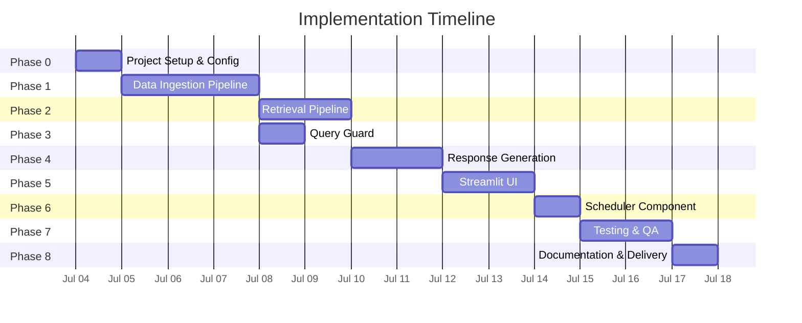
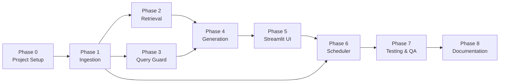

# Implementation Plan: Mutual Fund FAQ Assistant (RAG Chatbot)

> Phase-wise implementation plan derived from the [Architecture Document](file:///Users/arvindchaudhary/Downloads/RAG%20Chatbot/Docs/Architecture.md).

---

## Phase 0 — Project Setup & Environment Configuration
**Duration**: 1 day  
**Goal**: Scaffold the project, install dependencies, and configure secrets.

### Tasks

| # | Task | Files / Commands | Done |
|---|---|---|---|
| 0.1 | Initialize project directory structure as defined in Architecture §5 | Create `src/`, `data/`, `tests/`, `Docs/` directories and `__init__.py` files | ☐ |
| 0.2 | Create Python virtual environment | `python -m venv .venv && source .venv/bin/activate` | ☐ |
| 0.3 | Create `requirements.txt` with all dependencies | `beautifulsoup4`, `requests`, `playwright`, `langchain`, `langchain-community`, `chromadb`, `sentence-transformers`, `groq`, `streamlit`, `python-dotenv`, `pytest` | ☐ |
| 0.4 | Install dependencies | `pip install -r requirements.txt` | ☐ |
| 0.5 | Create `.env` file with API keys | `GROQ_API_KEY=<key>` | ☐ |
| 0.6 | Create `.gitignore` | Exclude `.env`, `.venv/`, `data/raw/`, `data/vectorstore/`, `__pycache__/` | ☐ |
| 0.7 | Create `src/utils/config.py` | Centralized config loader using `python-dotenv` for Groq API key, model names, chunk sizes, etc. | ☐ |

### Deliverables
- Working project skeleton with all dependencies installed
- Configuration module (`config.py`) loading environment variables

### Verification
- `python -c "import langchain, chromadb, groq, streamlit; print('OK')"` runs without errors

---

## Phase 1 — Data Ingestion Pipeline
**Duration**: 2–3 days  
**Goal**: Scrape, clean, chunk, and store content from the 5 Groww URLs.

### Tasks

| # | Task | File | Details |
|---|---|---|---|
| 1.1 | Build Web Scraper | `src/ingestion/scraper.py` | Fetch HTML from 5 Groww URLs using `requests` + `BeautifulSoup`. Fall back to `Playwright` if pages are JS-rendered. Store raw HTML in `data/raw/` with timestamps. |
| 1.2 | Build Text Cleaner | `src/ingestion/cleaner.py` | Strip HTML tags, remove navigation/ads/footer. Extract scheme-specific content (fund details, tables, FAQ sections). Normalize whitespace. Preserve tabular data. |
| 1.3 | Build Chunker | `src/ingestion/chunker.py` | **Section-aware semantic chunking** (not blind character splitting). The cleaned data has well-defined structural sections that must be respected: | ☑ |

> **Why not a generic `RecursiveCharacterTextSplitter(500, 100)`?**
> The cleaned Groww pages are only 5–10 KB each but contain ~40% footer noise (Groww nav links, A–Z indexes, copyright). A blind 500-char splitter would: split markdown tables mid-row (corrupting holdings/returns data), mix unrelated sections into a single chunk, and embed useless footer content as searchable chunks.

> **Chunking Strategy (Task 1.3 — Detailed)**
>
> **Step 1 — Footer Stripping**: Truncate everything after the first occurrence of `"Contact Us"` or `"Download the App"`. This removes ~110–150 lines of Groww platform navigation, A–Z stock/MF indexes, copyright notices, and regulatory boilerplate that appear identically across all 5 files.
>
> **Step 2 — Section Detection**: Split the remaining content into semantic sections using these detected landmarks (present in all 5 cleaned files):
>
> | Section ID | Landmark / Trigger | Content Type |
> |---|---|---|
> | `overview` | Lines 1–23 (title through "Return calculator") | NAV, SIP minimum, AUM, expense ratio, rating |
> | `holdings` | Markdown table after "Holdings (" | Portfolio holdings table (3–85 rows) |
> | `min_investment` | `"Minimum investments"` | Min 1st/2nd investment, min SIP amounts |
> | `returns` | `"Annualised returns"` through next section | Returns table + category comparison table |
> | `similar_funds` | `"Compare similar funds"` | Peer comparison table (5 rows) |
> | `fund_management` | `"Fund management"` | Fund manager bios (keep bios, discard the long list of other managed funds — 30–50 noise lines per manager) |
> | `fund_info` | `"About"` through `"Registrar"` block | Benchmark, fund house details, custodian, launch date, contact |
>
> **Step 3 — Atomic Table Handling**: Any markdown table (detected by `| ... |` row patterns) is kept as a single atomic chunk — never split across chunks. Tables range from 3 rows (ETF FoFs) to 85 rows (Small Cap holdings); even the largest (~4 KB) fits within embedding model context.
>
> **Step 4 — Intra-section Splitting**: For non-table text sections that exceed `chunk_size=500` characters, apply `RecursiveCharacterTextSplitter(chunk_size=500, chunk_overlap=50)` as a fallback. Use `\n\n` → `\n` → `. ` → ` ` as separators.
>
> **Step 5 — Metadata Attachment**: Each chunk gets:
> - `source_url`: Original Groww URL
> - `scheme_name`: Extracted from line 1 (e.g., "HDFC Silver ETF FoF Direct Growth")
> - `section_type`: One of the Section IDs above (enables metadata-filtered retrieval)
> - `scrape_date`: ISO timestamp from filename
> - `has_table`: Boolean flag for chunks containing markdown tables
>
> **Expected Output**: ~8–12 chunks per scheme (vs. ~15–20 with blind splitting), each semantically coherent. Save as JSON in `data/processed/`.
| 1.4 | Build Embedder | `src/embeddings/embedder.py` | Load `BAAI/bge-small-en-v1.5` via `sentence-transformers`. Generate embeddings for all chunks. Store embeddings + metadata in ChromaDB (`data/vectorstore/`). |

> **Embedding Model Decision: `bge-small-en-v1.5` (384d) over `bge-large-en-v1.5` (1024d)**
>
> Based on analysis of the 55 generated chunks, `bge-small` is the correct choice for this project:
>
> | Factor | Our Data | Implication |
> |---|---|---|
> | Corpus size | **55 chunks** across 5 schemes | Tiny corpus — large model's extra capacity is wasted; no dense retrieval bottleneck |
> | Avg chunk size | **424 chars** (~106 tokens) | Short chunks with low token count; BGE-small handles these with near-identical quality to BGE-large |
> | Max chunk size | **5,118 chars** (~1,280 tokens) — holdings table | Within BGE-small's 512-token context window when truncated; but holdings are matched by `scheme_name` metadata filter, not semantic similarity |
> | Content complexity | Structured key-value pairs, markdown tables, short financial facts | Low semantic ambiguity — queries like "expense ratio HDFC Mid Cap" are near-exact lexical matches, not complex paraphrases |
> | Query patterns | Factual lookups: "NAV", "expense ratio", "SIP minimum", "top holdings" | Domain-specific but formulaic; BGE-small's MTEB retrieval score (51.68) vs BGE-large (54.29) is negligible for this vocabulary |
> | Inference speed | BGE-small: ~33M params, ~4x faster | Faster embedding at ingestion and query time; matters for Streamlit UX |
> | Memory footprint | BGE-small: ~130MB vs BGE-large: ~1.3GB | 10x smaller; avoids the risk row "BGE model too large for local machine" entirely |
> | ChromaDB storage | 384d × 55 chunks = ~84 KB vs 1024d × 55 = ~225 KB | Negligible either way, but smaller index = faster cosine search |
>
> **When would BGE-large be justified?** If the corpus grew to 1000+ chunks with complex prose (e.g., full scheme documents, SEBI circulars) where paraphrase detection matters. For 55 structured FAQ-style chunks, BGE-small delivers equivalent retrieval quality at a fraction of the cost.
>
> **Embedding Strategy Details:**
> - Use `query_instruction="Represent this sentence for searching relevant passages:"` prefix for query embeddings (BGE best practice)
> - Embed chunk content only (not metadata) — metadata is used for post-retrieval filtering
> - ChromaDB collection name: `mutual_funds`
> - Distance metric: `cosine` (default for BGE models)
> - Batch embed all 55 chunks in a single pass (fits comfortably in memory)
| 1.5 | Create ingestion runner script | `src/ingestion/run_ingestion.py` | Orchestrate the full pipeline: scrape → clean → chunk → embed → store. Callable via CLI: `python -m src.ingestion.run_ingestion`. |
| 1.6 | Write unit tests for ingestion | `tests/test_scraper.py`, `tests/test_chunker.py` | Test scraper returns valid HTML, cleaner strips tags correctly, chunker produces expected chunk sizes and metadata. |

### Source URLs

| Scheme | URL |
|---|---|
| HDFC Gold ETF FoF | `https://groww.in/mutual-funds/hdfc-gold-etf-fund-of-fund-direct-plan-growth` |
| HDFC Large Cap Fund | `https://groww.in/mutual-funds/hdfc-large-cap-fund-direct-growth` |
| HDFC Small Cap Fund | `https://groww.in/mutual-funds/hdfc-small-cap-fund-direct-growth` |
| HDFC Silver ETF FoF | `https://groww.in/mutual-funds/hdfc-silver-etf-fof-direct-growth` |
| HDFC Mid Cap Fund | `https://groww.in/mutual-funds/hdfc-mid-cap-fund-direct-growth` |

### Deliverables
- Raw HTML files in `data/raw/`
- Processed chunk JSONs in `data/processed/`
- Populated ChromaDB vector store in `data/vectorstore/`
- Passing unit tests

### Verification
- Run ingestion script end-to-end; verify ChromaDB contains expected number of chunks
- `python -c "import chromadb; client = chromadb.PersistentClient('data/vectorstore'); print(client.get_collection('mutual_funds').count())"` returns > 0

---

## Phase 2 — Retrieval Pipeline
**Duration**: 1–2 days  
**Goal**: Build the vector search and retrieval layer.

> **Data-Driven Retrieval Strategy (Based on Actual Chunk Analysis)**
>
> ChromaDB contains **110 chunks** (55 unique × 2 scrape timestamps) across 5 schemes with 384d BGE-small embeddings.
>
> **Key observations that shape retrieval design:**
>
> | Observation | Impact on Retrieval |
> |---|---|
> | Chunks are duplicated across 2 scrape timestamps per scheme | Must **deduplicate** by preferring the latest `scrape_date` or returning only unique content |
> | Noise chunks exist: `"Holdings (\n3\n)"`, `"See All"`, `"Annualised returns\nAbsolute returns"`, `"Compare similar funds"` — section headers with no actual data | Must **filter out** chunks with `len(content) < 20` characters at retrieval time |
> | Rich metadata on every chunk: `scheme_name`, `section_type`, `has_table`, `source_url`, `scrape_date` | Enables **metadata-filtered retrieval** — when query mentions a specific scheme, filter by `scheme_name` first to avoid cross-scheme pollution |
> | Only 5 unique schemes exist | **Scheme name extraction** from query is feasible with simple substring matching against the 5 known scheme names |
> | Section types map directly to query intent: "expense ratio" → `overview`, "holdings" → `holdings`, "SIP minimum" → `min_investment`, "returns" → `returns` | **Section-type boosting** is possible but not required for K=5; metadata filter by `scheme_name` alone provides sufficient precision |
> | Largest chunk is ~5KB (holdings table); smallest useful chunk is ~90 chars (min_investment) | No chunk-size normalization needed — cosine similarity handles varied lengths well with BGE |
> | Corpus is tiny (55 unique chunks) — cosine search is sub-millisecond | No need for ANN indexes or HNSW tuning; brute-force cosine is fine |
>
> **Retrieval Flow:**
> ```
> User Query
>   │
>   ├─→ Extract scheme_name (if mentioned) → ChromaDB `where` filter
>   │
>   ├─→ Embed query with BGE instruction prefix
>   │
>   ├─→ ChromaDB similarity search (top_k=5, cosine)
>   │     └─ with optional scheme_name filter
>   │
>   ├─→ Post-retrieval filtering:
>   │     ├─ Remove noise chunks (content < 20 chars)
>   │     ├─ Deduplicate by content (keep latest scrape_date)
>   │     └─ Cap at K=3 final results
>   │
>   └─→ Return ranked chunks with metadata
> ```

### Tasks

| # | Task | File | Details | Done |
|---|---|---|---|---|
| 2.1 | Build ChromaDB wrapper | `src/retrieval/vector_store.py` | Initialize ChromaDB `PersistentClient`, load the `mutual_funds` collection. Expose `query(embedding, top_k, where_filter)` method. Handle the case where collection doesn't exist (raise clear error). | ☑ |
| 2.2 | Build Retriever | `src/retrieval/retriever.py` | Accept a user query string. (1) Extract `scheme_name` from query via substring match against 5 known schemes. (2) Embed query using `Embedder.embed_query()` with BGE instruction prefix. (3) Query ChromaDB with `top_k=5` and optional `scheme_name` filter. (4) Post-filter: remove noise chunks (`len < 20`), deduplicate by content (keep latest `scrape_date`), cap at final `K=3`. (5) Return list of `RetrievedChunk` dicts with `content`, `metadata`, `distance`. | ☑ |
| 2.3 | Write retrieval tests | `tests/test_retriever.py` | Test that (a) "expense ratio HDFC Small Cap" returns the overview chunk for Small Cap, (b) "top holdings HDFC Mid Cap" returns the holdings table chunk, (c) scheme_name filter excludes other schemes, (d) noise chunks like "See All" are filtered out, (e) deduplication reduces 2 identical chunks to 1. | ☑ |

### Deliverables
- Working retriever that returns top-K relevant chunks for any query
- Scheme-name extraction correctly identifies mentioned fund
- Noise filtering removes empty/header-only chunks
- Deduplication handles the 2-timestamp duplication
- Passing retrieval quality tests

### Verification
- Manual test: run 5 sample queries and inspect returned chunks for relevance
- `pytest tests/test_retriever.py` passes

---

## Phase 3 — Query Guard (Refusal Classifier)
**Duration**: 1 day  
**Goal**: Detect and refuse advisory, opinion-based, or out-of-scope queries.

### Tasks

| # | Task | File | Details | Done |
|---|---|---|---|---|
| 3.1 | Build Query Guard | `src/generation/query_guard.py` | Implement keyword + pattern matching for advisory phrases (`"should I invest"`, `"which is better"`, `"recommend"`, `"predict"`, `"suggest"`). Return classification: `FACTUAL` or `ADVISORY`. | ☑ |
| 3.2 | Build PII detector | `src/generation/query_guard.py` | Regex patterns to detect PAN (`[A-Z]{5}[0-9]{4}[A-Z]`), Aadhaar (12-digit), phone numbers, email addresses. Block queries containing PII. | ☑ |
| 3.3 | Define refusal response templates | `src/generation/prompt_templates.py` | Polite refusal message + link to AMFI/SEBI educational resources. PII warning message. | ☑ |
| 3.4 | Write guard tests | `tests/test_query_guard.py` | Test 20+ advisory prompts are correctly refused. Test 20+ factual prompts pass through. Test PII detection works for various formats. | ☑ |

### Deliverables
- Query guard correctly classifying factual vs. advisory queries
- PII detection blocking sensitive inputs
- Passing test suite

### Verification
- `pytest tests/test_query_guard.py` — all tests pass
- Manual test with edge cases (e.g., "Is this fund's expense ratio good?" — should refuse)

---

## Phase 4 — Response Generation (LLM + Formatter)
**Duration**: 2 days  
**Goal**: Integrate Groq LLM, build prompt templates, and format responses.

### Tasks

| # | Task | File | Details |
|---|---|---|---|
| 4.1 | Define prompt templates | `src/generation/prompt_templates.py` | System prompt (facts-only rules, 3-sentence limit, citation requirement). User prompt template with `{retrieved_chunks}` and `{user_query}` placeholders. |
| 4.2 | Build LLM generator | `src/generation/generator.py` | Initialize Groq client with API key. Use `llama-3.3-70b-versatile` model. Implement robust rate-limit handling using `tenacity` for exponential backoff to handle strict Groq limits (30 RPM, 12K TPM, 1K RPD, 100K TPD). Send assembled prompt (system + context + query) and return response. |
| 4.3 | Build response formatter | `src/utils/formatter.py` | Ensure response has ≤ 3 sentences using `nltk.sent_tokenize`. Append source citation URL. Append footer: `"Last updated from sources: <YYYY-MM-DD>"`. Handle edge case where LLM says "I don't have this information." |
| 4.4 | Build end-to-end query chain | `src/generation/generator.py` | Wire together: Query Guard → Retriever → Prompt Assembly → Groq LLM → Formatter. Single function `answer_query(user_query) -> formatted_response`. |
| 4.5 | Write generation tests | `tests/test_generator.py` | Test prompt assembly is correct. Test response format validation. Test exponential backoff handles `groq.RateLimitError` gracefully. Test end-to-end with mocked LLM responses. |

> **Handling Groq Rate Limits (llama-3.3-70b-versatile)**
> Groq imposes strict rate limits for this model: **30 RPM (requests per minute)**, **12K TPM (tokens per minute)**, **1K RPD**, and **100K TPD**.
> To prevent application crashes during traffic spikes, the `generator.py` will wrap Groq API calls in a `@retry` decorator using the `tenacity` library. If a `RateLimitError` (HTTP 429) is thrown, it will use exponential backoff to wait and safely retry the request.


### Deliverables
- Fully functional query pipeline callable via `answer_query()`
- Responses follow required format (≤3 sentences + source + date footer)
- Passing tests

### Verification
- Run 10 sample queries end-to-end via CLI and verify output quality
- `pytest tests/test_generator.py` passes

---

## Phase 5 — Streamlit User Interface
**Duration**: 2 days  
**Goal**: Build a clean, minimal chat interface with disclaimer and example questions.

### Tasks

| # | Task | File | Details | Done |
|---|---|---|---|---|
| 5.1 | Build main Streamlit app | `src/app.py` | App title: "HDFC Mutual Fund FAQ Assistant". Persistent disclaimer banner: "Facts-only. No investment advice." Welcome message describing assistant capabilities. | ☑ |
| 5.2 | Add example questions | `src/app.py` | 3 clickable example buttons: (1) "What is the expense ratio of HDFC Small Cap Fund?" (2) "What is the exit load for HDFC Mid Cap Fund?" (3) "What is the minimum SIP amount for HDFC Large Cap Fund?" | ☑ |
| 5.3 | Implement chat interface | `src/app.py` | Text input for user queries. Scrollable chat history using `st.session_state`. Display user messages and assistant responses with formatted citations. | ☑ |
| 5.4 | Wire UI to query pipeline | `src/app.py` | On user input or example click → call `answer_query()` → display formatted response. Show refusal responses for advisory queries. | ☑ |
| 5.5 | Add styling and polish | `src/app.py` | Clean layout, consistent font sizes, color-coded disclaimer banner, loading spinner during LLM calls. | ☑ |

### UI Wireframe

```
┌──────────────────────────────────────────────┐
│  🏦 HDFC Mutual Fund FAQ Assistant           │
│  ⚠️ Facts-only. No investment advice.        │
├──────────────────────────────────────────────┤
│                                              │
│  Welcome! I can answer factual questions     │
│  about HDFC Mutual Fund schemes.             │
│                                              │
│  Try asking:                                 │
│  [Expense ratio of HDFC Small Cap Fund?]     │
│  [Exit load for HDFC Mid Cap Fund?]          │
│  [Min SIP for HDFC Large Cap Fund?]          │
│                                              │
├──────────────────────────────────────────────┤
│  👤 What is the expense ratio of HDFC        │
│     Small Cap Fund?                          │
│                                              │
│  🤖 The expense ratio of HDFC Small Cap      │
│     Fund (Direct Plan) is 0.68%.             │
│                                              │
│     Source: https://groww.in/mutual-funds/... │
│     Last updated from sources: 2026-07-03    │
├──────────────────────────────────────────────┤
│  💬 Ask a question...                   [▶]  │
└──────────────────────────────────────────────┘
```

### Deliverables
- Fully functional Streamlit chat app
- Disclaimer, welcome message, and example questions visible
- Chat history preserved in session

### Verification
- `streamlit run src/app.py` launches without errors
- Manual walkthrough: test example questions, factual queries, advisory queries, and PII inputs

---

## Phase 6 — Scheduler Component (Automated Daily Re-Ingestion via GitHub Actions)
**Duration**: 1 day  
**Goal**: Automate the ingestion pipeline to run daily using GitHub Actions, ensuring the vector store always contains the latest data from Groww.

> **Why GitHub Actions?**
> The ingestion pipeline (Phase 1) was initially designed as a one-time offline process. However, mutual fund data (NAV, returns, holdings) changes daily. Without scheduled re-ingestion, the chatbot would serve stale data.
>
> GitHub Actions is the ideal scheduler for this project because:
> - **No additional runtime dependency** — no need for APScheduler, no long-running background process
> - **Built-in cron scheduling** — native `schedule` trigger with cron expressions
> - **Version-controlled configuration** — the schedule lives in the workflow YAML alongside the code
> - **Built-in logging & alerting** — workflow run history, failure notifications via GitHub email/Slack
> - **Secrets management** — `GROQ_API_KEY` stored securely in GitHub repository secrets
> - **Free tier** — 2,000 minutes/month for public repos, 500 for private (more than enough for a daily 2-minute job)

### Tasks

| # | Task | File | Details |
|---|---|---|---|
| 6.1 | Create GitHub Actions workflow | `.github/workflows/daily_ingestion.yml` | Define a workflow triggered by `schedule` (cron: `30 20 * * *` = 02:00 AM IST / 20:30 UTC daily) and `workflow_dispatch` (manual trigger). Set up Python environment, install dependencies, run the ingestion pipeline, and commit updated data back to the repository. |
| 6.2 | Add ingestion runner script for CI | `scripts/run_ingestion_ci.py` | Wrapper script that: (1) Performs a health check (HTTP HEAD to `groww.in`), (2) Calls `run_ingestion.main()`, (3) Verifies ChromaDB chunk count post-ingestion, (4) Writes a summary to `data/ingestion_log.json` with `{timestamp, status, duration_seconds, chunks_count, error_message}`, (5) Exits with non-zero code on failure (so GitHub Actions marks the run as failed). |
| 6.3 | Configure repository secrets | GitHub Settings | Add `GROQ_API_KEY` as a repository secret. The workflow injects it as an environment variable during the ingestion run. |
| 6.4 | Set up data commit & push step | `.github/workflows/daily_ingestion.yml` | After ingestion, commit changes to `data/raw/`, `data/processed/`, `data/vectorstore/`, and `data/ingestion_log.json` using `git add` + `git commit` + `git push`. Use a bot identity (`github-actions[bot]`) for the commit. Skip commit if no files changed (idempotent). |
| 6.5 | Add ingestion log display to Streamlit | `src/app.py` | Read `data/ingestion_log.json` on app load. Display the last ingestion timestamp in the UI footer (e.g., "Data last refreshed: 2026-07-04 02:00 IST"). Show a warning banner if last ingestion is older than 48 hours. |
| 6.6 | Add manual workflow dispatch trigger | `.github/workflows/daily_ingestion.yml` | Enable `workflow_dispatch` so maintainers can trigger re-ingestion on-demand from the GitHub Actions UI (Actions tab → "Run workflow" button). |
| 6.7 | Configure failure notifications | `.github/workflows/daily_ingestion.yml` | GitHub sends email notifications on workflow failure by default. Optionally add a Slack notification step using `slackapi/slack-github-action` for team visibility. |
| 6.8 | Write CI workflow validation tests | `tests/test_ci_ingestion.py` | Test the CI runner script: (a) health check passes/fails gracefully, (b) ingestion log is written correctly, (c) exit codes are correct for success/failure scenarios. |

### Workflow Definition (`.github/workflows/daily_ingestion.yml`)

```yaml
name: Daily Data Ingestion

on:
  schedule:
    # 02:00 AM IST = 20:30 UTC (previous day)
    - cron: '30 20 * * *'
  workflow_dispatch:  # Manual trigger from GitHub UI

jobs:
  ingest:
    runs-on: ubuntu-latest
    permissions:
      contents: write  # Required for git push

    steps:
      - name: Checkout repository
        uses: actions/checkout@v4

      - name: Set up Python
        uses: actions/setup-python@v5
        with:
          python-version: '3.10'
          cache: 'pip'

      - name: Install dependencies
        run: pip install -r requirements.txt

      - name: Install Playwright browsers
        run: playwright install chromium

      - name: Run ingestion pipeline
        env:
          GROQ_API_KEY: ${{ secrets.GROQ_API_KEY }}
        run: python scripts/run_ingestion_ci.py

      - name: Commit and push updated data
        run: |
          git config user.name "github-actions[bot]"
          git config user.email "github-actions[bot]@users.noreply.github.com"
          git add data/raw/ data/processed/ data/vectorstore/ data/ingestion_log.json
          git diff --staged --quiet || git commit -m "chore: daily data ingestion $(date -u +%Y-%m-%dT%H:%M:%SZ)"
          git push
```

### Architecture

```
┌─────────────────────────────────────────────────────────┐
│              GITHUB ACTIONS                              │
│  ┌─────────────────────────────────────────────────┐    │
│  │ Workflow: daily_ingestion.yml                    │    │
│  │  Trigger: cron (20:30 UTC / 02:00 IST daily)    │    │
│  │           + workflow_dispatch (manual)            │    │
│  │  ┌─────────────────────────────────────────┐    │    │
│  │  │ Job: ingest                              │    │    │
│  │  │  1. Checkout repo                        │    │    │
│  │  │  2. Setup Python + dependencies          │    │    │
│  │  │  3. Health check (groww.in)              │    │    │
│  │  │  4. run_ingestion.main()                 │    │    │
│  │  │  5. Verify ChromaDB chunk count          │    │    │
│  │  │  6. Log result to ingestion_log.json     │    │    │
│  │  │  7. git commit + push updated data       │    │    │
│  │  └─────────────────────────────────────────┘    │    │
│  └─────────────────────────────────────────────────┘    │
│                                                          │
│  On Failure → Email notification (default)               │
│               + optional Slack alert                     │
└─────────────────────────────────────────────────────────┘
```

### Deliverables
- GitHub Actions workflow that triggers daily ingestion at 02:00 AM IST
- Manual `workflow_dispatch` for on-demand re-ingestion from GitHub UI
- CI runner script with health check, verification, and structured logging
- Ingestion log (`data/ingestion_log.json`) tracking each run
- Streamlit footer displaying "Data last refreshed" timestamp with staleness warning
- Automated commit of updated data back to the repository
- Failure notifications via GitHub email (+ optional Slack)
- Passing CI runner tests

### Verification
- `pytest tests/test_ci_ingestion.py` — all tests pass
- Manually trigger the workflow via GitHub Actions UI → verify it runs the ingestion pipeline and commits updated data
- Check `data/ingestion_log.json` is updated with the latest run entry
- Verify Streamlit footer shows correct "Data last refreshed" timestamp
- Simulate a failure (e.g., invalid URL) → verify GitHub sends a failure notification email

---

## Phase 7 — Testing & Quality Assurance
**Duration**: 1–2 days  
**Goal**: Comprehensive testing across all components.

### Tasks

| # | Task | Details | Done |
|---|---|---|---|
| 7.1 | Run full unit test suite | `pytest tests/ -v` — all tests must pass | ☑ |
| 7.2 | Integration test: end-to-end pipeline | 10 factual queries → verify correct answers with citations | ☑ |
| 7.3 | Refusal test suite | 20+ advisory queries → verify all are refused politely | ☑ |
| 7.4 | PII rejection tests | Test with PAN, Aadhaar, phone, email formats | ☑ |
| 7.5 | Response format validation | Verify ≤3 sentences, exactly 1 citation link, footer present | ☑ |
| 7.6 | Edge case testing | Empty input, very long input, non-English input, special characters | ☑ |
| 7.7 | Performance testing | Measure query latency (target: < 3 seconds end-to-end) | ☑ |
| 7.8 | Scheduler integration test | Verify scheduler triggers ingestion correctly, logs results, and Streamlit shows updated timestamp | ☑ |

### Test Matrix

| Query Type | Expected Behavior | Count |
|---|---|---|
| Factual (in-scope) | Correct answer + citation + footer | 10+ |
| Advisory / Opinion | Polite refusal + AMFI link | 20+ |
| Out-of-scope (other AMC) | "I don't have this information" | 5+ |
| PII in input | Security warning, query blocked | 5+ |
| Empty / malformed | Prompt to ask a valid question | 3+ |

### Deliverables
- All tests passing
- Test report documenting results

### Verification
- `pytest tests/ -v --tb=short` — 100% pass rate
- Manual QA checklist completed

---

## Phase 8 — Documentation & Final Delivery
**Duration**: 1 day  
**Goal**: Complete all documentation and prepare for handoff.

### Tasks

| # | Task | File | Details |
|---|---|---|---|
| 8.1 | Write README | `README.md` | Project overview, setup instructions, how to run ingestion, how to start the app, scheduler configuration, selected AMC and schemes, architecture summary, known limitations. |
| 8.2 | Add inline code comments | All `src/` files | Ensure every module, class, and function has docstrings. |
| 8.3 | Document environment setup | `README.md` | Step-by-step: clone repo → create venv → install deps → set `.env` → run ingestion → configure scheduler → launch app. |
| 8.4 | Document scheduler configuration | `README.md` | Document `.env` scheduler variables (`SCHEDULER_ENABLED`, `SCHEDULER_CRON_HOUR`, `SCHEDULER_CRON_MINUTE`, `SCHEDULER_TIMEZONE`), standalone runner usage, and admin manual refresh. |
| 8.5 | Add disclaimer | `README.md` + UI | "Facts-only. No investment advice." prominently displayed. |
| 8.6 | Final review | All files | Code review for clean structure, no hardcoded secrets, consistent naming. |

### Deliverables
- Complete `README.md` with setup and usage instructions
- Well-documented codebase
- All deliverables from [problemStatement.md](file:///Users/arvindchaudhary/Downloads/RAG%20Chatbot/Docs/problemStatement.md) fulfilled

---

## Timeline Summary



> **Note**: Phase 2 and Phase 3 can be executed in parallel since they have no interdependencies.
> Phase 6 (Scheduler) depends on Phase 5 (UI) because the scheduler integrates with the Streamlit app for displaying last-refresh timestamps and the manual refresh button.

---

## Phase Dependencies



---

## Risk Mitigation

| Risk | Impact | Mitigation |
|---|---|---|
| Groww pages are JS-rendered and `requests` fails | Ingestion blocked | Fall back to `Playwright` for scraping |
| Groww changes page structure | Scraper breaks | Design scraper with CSS selector configs that are easy to update |
| Groq API rate limits or downtime | User gets errors | Implement retry with exponential backoff; cache frequent responses |
| ~~BGE model too large for local machine~~ | ~~Slow embeddings~~ | **Resolved**: Using `bge-small-en-v1.5` (384d, ~130MB) as the primary model — eliminates this risk entirely. See Task 1.4 rationale. |
| Low retrieval quality | Irrelevant answers | Tune `chunk_size`, `chunk_overlap`, and `top_k`; add re-ranker in Phase 4 |
| PII leakage through prompts | Privacy violation | PII detection runs before any LLM call; never log user inputs |
